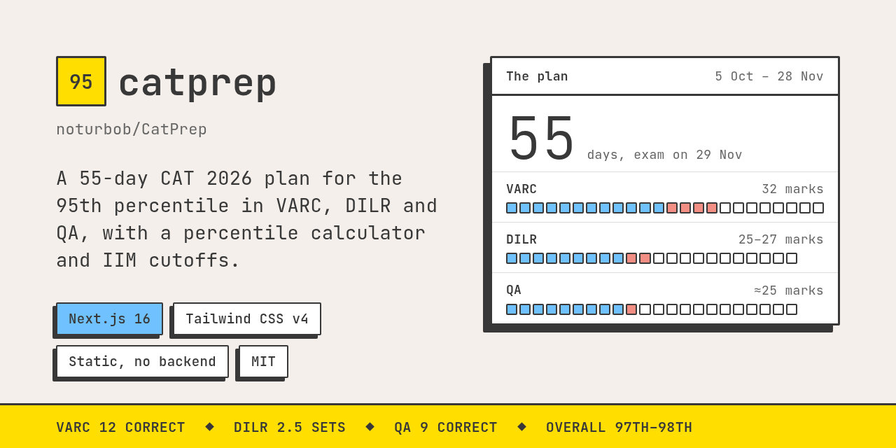

# catprep



A static site for one goal: the 95th percentile in every CAT 2026 section. It turns four study guides into one
55-day plan, from 5 October to the exam on 29 November.

| Section | Target | What's there |
| --- | --- | --- |
| [Today](src/app/page.tsx) | | Day count, today's QA task, this week's VARC and DILR focus, admission deadlines |
| [Plan](src/app/plan) | | The 7-phase chart with 12 mocks, daily routine, week-by-week checklist |
| [QA](src/app/qa) | 9 correct of 22 | Toolkit, exam-day rules, 12 chapters of arithmetic and easy algebra, error log |
| [VARC](src/app/varc) | 12 correct of 24 | Reading method, four passages, the four VA question types, practice set, error log |
| [DILR](src/app/dilr) | 2.5 sets | The 5-minute scan, one method for every set, 14 worked sets with practice, error log |
| [Admissions](src/app/admissions) | 97th–98th overall | Score-to-percentile calculator, IIM weightage and cutoffs, NIRF top 50, backup exams |

Every worked example, passage, set and practice question comes from the guides and is original, written to mirror
recurring CAT patterns; none is a past-paper question. Cutoffs and dates are as of 6 October 2026.

## How it's built

- Next.js 16 (App Router), every page prerendered; no database, no auth, no server code.
- Tailwind CSS v4. Neo-brutalist light theme, with a dark theme revealed through a View Transition.
- Content is data in `src/content/` (`qa.ts`, `varc.ts`, `dilr.ts`, `admissions.ts`, `plan.ts`, `logs.ts`); pages render it.
- Checklist ticks and the three error logs live in the browser's localStorage.
- Formulas are rendered with KaTeX at build time.

## Run it

```sh
pnpm install
pnpm dev     # http://localhost:3000
pnpm test    # plan date maths, percentile interpolation, and DI chart data against the guides' printed answers
pnpm build
```

Set `NEXT_PUBLIC_SITE_URL` to the deployed origin so social previews resolve to absolute URLs. On Vercel the
production URL is picked up automatically.

## Licence

[MIT](LICENSE)
